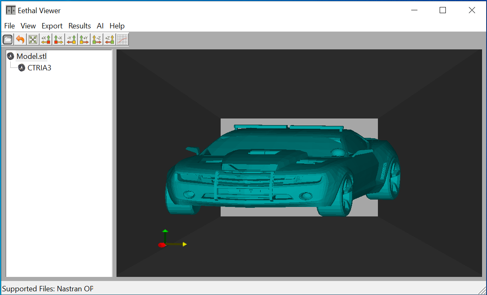
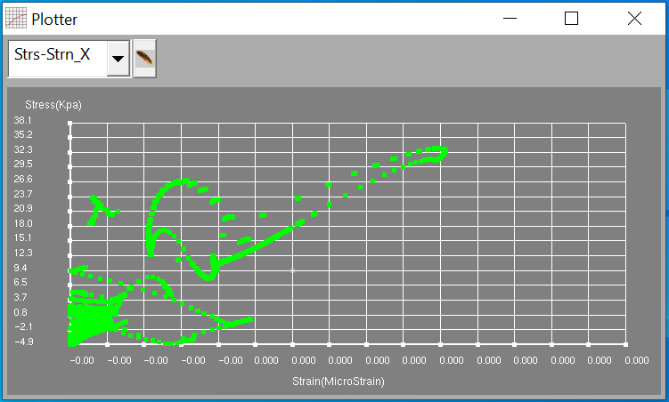
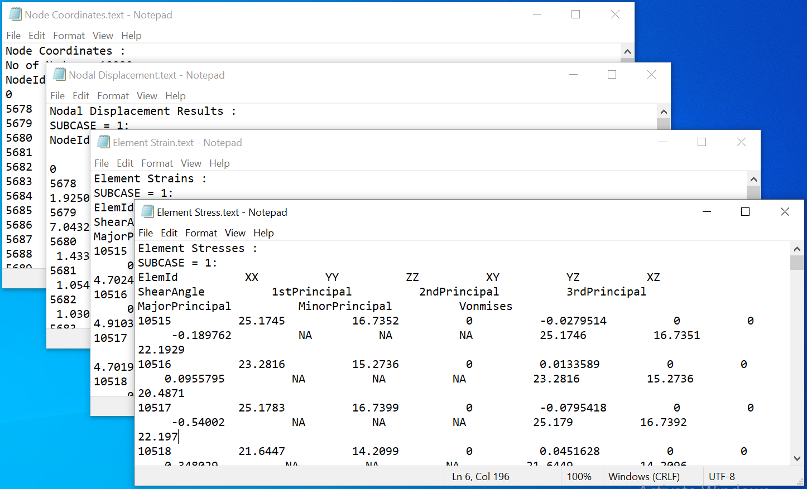

# EethalView
EethalView is a 3D CAE viewer to read and visualize Nastran OP2 Finite Element Model and STL files. It is developed using C++, OpenGl, and Wxwidgets.

Eethal Viewer features in-built 2D plotter and enables you to export the node coordinates, element connectivity and the result data to a text file.

OPERATING SYSTEM :

Windows 10/8/7/vista/Xp/2000/98/95

