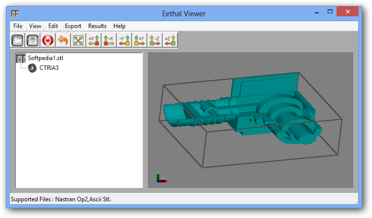

# EethalView
EethalView is a 3D CAE viewer to read and visualize Nastran OP2 Finite Element Model and STL files.

Eethal Viewer features auto-rotation, in-built 2D plotter and enables you to export the node coordinates, element connectivity and the result data to a text file.

